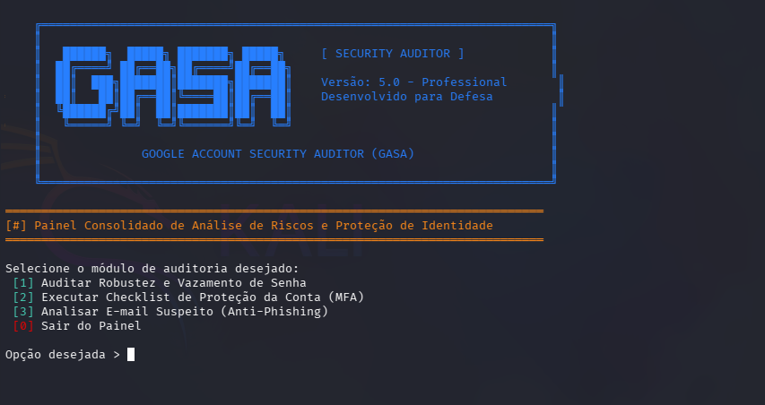

# GASA - Google Account Security Auditor 🛡️



## 📌 Sobre o Projeto

O **Google Account Security Auditor (GASA)** é uma ferramenta de linha de comando (**CLI**) desenvolvida em **Python** com foco em **segurança defensiva (Blue Team)** e aprendizagem de cibersegurança.

O objetivo do projeto é auxiliar utilizadores e estudantes de segurança a realizarem verificações básicas de proteção de contas digitais, analisando fatores como segurança de palavras-passe, exposição em vazamentos conhecidos e boas práticas de hardening.

O GASA foi criado como um projeto educacional para explorar conceitos como **hashing criptográfico, APIs de segurança, privacidade de dados e desenvolvimento seguro em Python**.

---

# 🚀 Funcionalidades

O GASA possui diferentes módulos de análise:

## 🔐 1. Análise de Segurança de Senhas

* Avaliação básica da força da palavra-passe.
* Análise de tamanho, complexidade e características estruturais.
* Estimativa do nível de resistência contra tentativas automatizadas.
* Verificação de exposição em vazamentos conhecidos através da API do **Have I Been Pwned (HIBP)**.
* Geração de palavras-passe fortes utilizando o módulo seguro `secrets` do Python.

---

## 🛡️ 2. Checklist de Hardening de Conta

Um questionário interativo para avaliar práticas importantes de proteção:

* Utilização de autenticação multifator (MFA).
* Existência de métodos de recuperação seguros.
* Uso de gestores de palavras-passe.
* Aplicação de boas práticas de segurança digital.

No final, o utilizador recebe recomendações para melhorar a postura de segurança da conta.

---

## 🎣 3. Análise Preventiva de Phishing

Módulo educativo para identificar características comuns de mensagens suspeitas:

* Verificação de padrões associados a phishing.
* Identificação de sinais de engenharia social.
* Recomendações para evitar ataques baseados em manipulação humana.

---

# 🔒 Privacidade e Segurança

## Consulta segura com Have I Been Pwned (k-Anonymity)

O GASA protege a privacidade do utilizador durante a verificação de vazamentos.

A palavra-passe real **nunca é enviada para serviços externos**.

O processo funciona da seguinte forma:

1. A palavra-passe é processada localmente utilizando SHA-1.
2. Apenas os primeiros caracteres do hash são enviados para a API do Have I Been Pwned.
3. A API retorna hashes correspondentes ao prefixo informado.
4. A comparação final é realizada localmente pelo GASA.

Dessa forma, a palavra-passe original permanece privada durante toda a verificação.

---

# ⚙️ Tecnologias Utilizadas

* **Python 3** — Linguagem principal do projeto.
* **Requests** — Comunicação com APIs externas.
* **Hashlib** — Operações de hashing criptográfico.
* **Secrets** — Geração segura de valores aleatórios.
* **Regex (Re)** — Validação e análise de padrões.

---

# 📂 Estrutura do Projeto

```text
GASA/
│
├── gasa.py
├── README.md
├── requirements.txt
├── LICENSE
└── gasa1-screenshot.png
```

---

# 🛠️ Instalação

## Pré-requisitos

* Python 3.10 ou superior
* Pip instalado

## Clonar o repositório

```bash
git clone https://github.com/cristiano-martins/gasa.git

cd gasa
```

## Instalar dependências

```bash
pip install -r requirements.txt
```

## Executar

```bash
python gasa.py
```

---

# 🖥️ Exemplo de Execução

```text
================================
 GASA - Google Account Security Auditor
================================

[+] Password Security Analysis
[+] Checking data exposure...
[+] Running account hardening checklist

Security Assessment Complete

Recommendations:
- Enable Multi-Factor Authentication
- Avoid password reuse
- Use a password manager
```

---

# 🛣️ Roadmap

## Concluído

* [x] Password strength analysis
* [x] HIBP integration
* [x] Secure password generator
* [x] Basic hardening checklist
* [x] CLI interface

## Futuro

* [ ] Exportação de relatórios em PDF/JSON
* [ ] Interface gráfica (GUI)
* [ ] Mais verificações de segurança
* [ ] Sistema de pontuação de risco
* [ ] Arquitetura modular avançada

---

# 📄 Licença

Este projeto está licenciado sob a licença **MIT**.

Você pode utilizar, modificar e distribuir o código, mantendo os créditos originais.

---

# ⚠️ Disclaimer

O GASA foi desenvolvido exclusivamente para **fins educacionais, pesquisa e auditoria defensiva**.

A ferramenta deve ser utilizada apenas em contas e ambientes onde exista autorização.

O autor não se responsabiliza por qualquer uso indevido da ferramenta.

